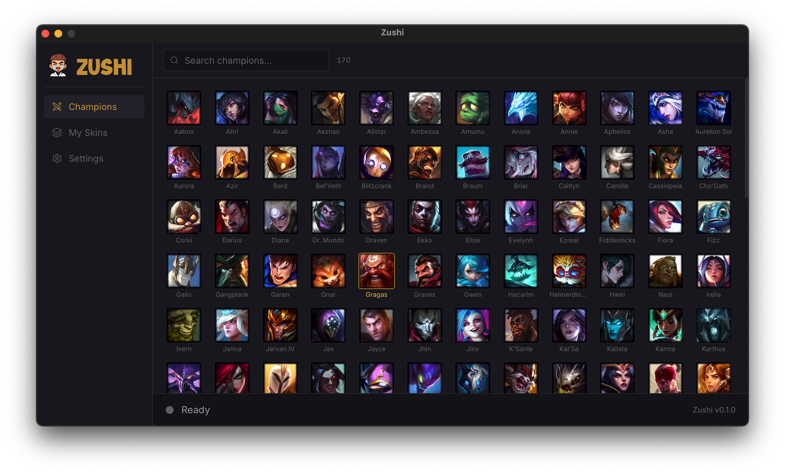

<p align="center">
  
</p>

<h1 align="center">Zushi</h1>

<p align="center">
  <a href="https://github.com/Mouadzz/zushi/releases/latest"></a>
</p>

<p align="center">
  
  
  
  
  
</p>

<p align="center">
  A lightweight desktop app to browse and apply League of Legends skins.
</p>

---

<p align="center">
  
</p>

## Features

- Browse all champions and their skins with splash art previews
- Download individual skins or batch download all skins for a champion
- Select and apply multiple skins at once - one per champion
- Import custom mods (.fantome/.zip)
- Real-time patcher status (importing, waiting for game, skins active, etc.)
- Game auto-detection - finds your League installation automatically
- Storage management - clear downloaded skins and patcher data
- macOS native - Apple Silicon and Intel

## Installation

1. Download the latest `.dmg` for your Mac from the [Releases page](https://github.com/Mouadzz/zushi/releases/latest):
   - **Apple Silicon** (M1/M2/M3/M4/M5...) - `Zushi_x.x.x_aarch64.dmg`
   - **Intel** - `Zushi_x.x.x_x64.dmg`
2. Open the `.dmg` and drag Zushi to your Applications folder
3. On first launch, macOS may show **"Zushi is damaged and can't be opened"** - this is normal for ad-hoc signed apps. To fix this, run in Terminal:
   ```
   xattr -cr /Applications/Zushi.app
   ```
   Then open the app again normally.

## Usage

1. **Start League client** - Open the Riot/League client first and leave it running.
2. **Run Zushi** - Open Zushi once the client is up.
3. **Download & apply skins** - Pick a champion, download skins if needed, then go to **My Skins**, select one skin per champion, and click **Apply**.
4. **Start your game** - With the patcher showing **Waiting for game**, queue up and play.

> **Important:** Apply the skin before champion select ends (use the default skin in client) so it is locked in when the game starts. If it does not apply, close the game, reopen League, run Zushi again, apply, and reconnect.

## Disclaimer

Zushi is not endorsed by Riot Games and does not reflect the views or opinions of Riot Games or anyone officially involved in producing or managing Riot Games properties. Riot Games and all associated properties are trademarks or registered trademarks of Riot Games, Inc.

Skins are visible only to you and do not affect gameplay or provide any competitive advantage. Use at your own risk.


## License

This project is licensed under the MIT License.

## Credits

- [cslol-manager](https://github.com/LeagueToolkit/cslol-manager) - modding tools
- [LeagueSkins](https://github.com/Alban1911/LeagueSkins) - a comprehensive collection of League of Legends skin assets, organized by champion and skin IDs
